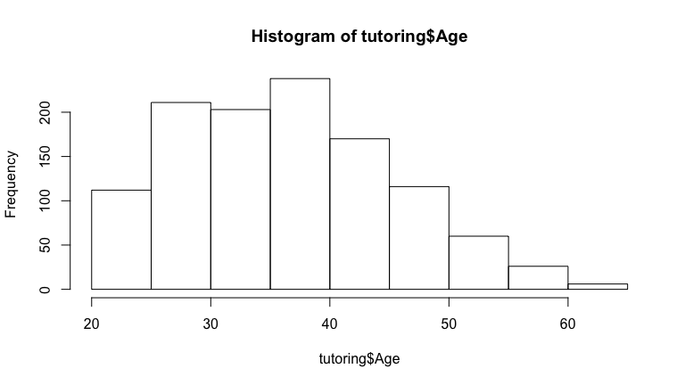
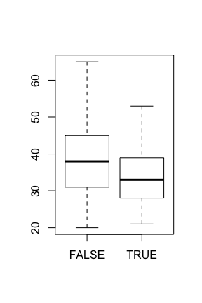

# Introduction to R
Jason Bryer, Ph.D.  
October 12, 2016  


## Agenda

* Overview
* Loading Data
* The R Language
* Statistics
* Data Visualization
* Document Preparation with R Markdown
* Advanced Statistics and Predictive Modeling
* Interactive Documents with Shiny

## Installation

* Instructions for R are here: https://github.com/jbryer/IntroR/blob/master/Installation/Install.md
	* R: https://cran.r-project.org/
	* RStudio: https://www.rstudio.com/products/rstudio/download/

* Downlaod workshop materials here: https://github.com/jbryer/IntroR


## Installing R Packages

Open the `Installation/setup.R` file in RStudio and click the `Source` button.

Or run this command in R:


```r
source('https://raw.githubusercontent.com/jbryer/IntroR/master/Installation/Setup.r')
```

This is the contents of that R script:


```r
pkgs <- c('tidyverse','devtools','reshape2','RSQLite',
		  'psa','multilevelPSA','PSAboot','TriMatch','likert',
		  'openintro','OIdata','psych','knitr','markdown','rmarkdown','shiny')

install.packages(pkgs)

devtools::install_github('jbryer/ipeds')
devtools::install_github('jbryer/sqlutils')
devtools::install_github("seankross/lego")
```

# Overview #####################################################################

## What is R?

"R is a language and environment for statistical computing and graphics. It is a GNU project which is similar to the S language and environment which was developed at Bell Laboratories (formerly AT&T, now Lucent Technologies) by John Chambers and colleagues..."

"R provides a wide variety of statistical (linear and non linear modeling, classical statistical tests, time-series analysis, classification, clustering, ...) and graphical techniques, and is highly extensible. The S language is often the vehicle of choice for research in statistical methodology, and R provides an Open Source route to participation in that activity."  
(R-project.org)


## Pros

>-  FREE!
	*R is available as Free Software under the terms of the Free Software Foundation's GNU General Public License in source code form. It compiles and runs on a wide variety of UNIX platforms and similar systems (including FreeBSD and Linux), Windows and MacOS.*
>-  Available for multiple platforms (i.e. Windows, Mac, Linux).
>-  Easily extensible with (currently) over 2,000 packages listed on CRAN.
>-  Scriptable.
>-  Publication grade graphics.
>-  Multiple ways of doing the same thing.
>-  Quickly becoming the *de facto* standard among statistician.

## Cons

>-  Has a steeper learning curve.
>-  Multiple ways of doing the same thing.
>-  Can have difficulty with *very* large datasets.

## The Popularity of R {.flexbox .vcenter}


Firth, D (2011). R and citations. Weblog entry at URL https://statgeek.wordpress.com/2011/06/25/r-and-citations/.

See also: Muenchen, R.A. (2015). The Popularity of Data Analysis Software. Welog entry at URL http://r4stats.com/articles/popularity/

## R's Roots... S

* S is a language that was developed by John Chambers and others at Bell Labs.
* S was initiated in 1976 as an internal statistical analysis environment - originally implemented as Fortran libraries.
* Early versions of the language did not contain functions for statistical modeling.
* In 1988 the system was rewritten in C and began to resemble the system that we have today (this was Version 3 of the language). The book Statistical Models in S by Chambers and Hastie (the blue book) documents the statistical analysis functionality.
* Version 4 of the S language was released in 1998 and is the version we use today. The book Programming with Data by John Chambers (the green book) documents this version of the language.


## History of S

* In 1993 Bell Labs gave StatSci (now Insightful Corp.) an exclusive license to develop and sell the S language.
* In 2004 Insightful purchased the S language from Lucent for \$2 million and is the current owner.
* In 2006, Alcatel purchased Lucent Technologies and is now called Alcatel-Lucent.
* Insightful sells its implementation of the S language under the product name S-PLUS and has built a number of fancy features (GUIs, mostly) on top of it-hence the "PLUS".
* In 2008 Insightful is acquired by TIBCO for \$25 million; future of S-PLUS is uncertain.
* The S language itself has not changed dramatically since 1998.
* In 1998, S won the Association for Computing Machinery's Software System Award.


##  

In "Stages in the Evolution of S", John Chambers writes:

<blockquote>"[W]e wanted users to be able to begin in an interactive environment, where they did not consciously think of themselves as programming. Then as their needs became clearer and their sophistication increased, they should be able to slide gradually into programming, when the language and system aspects would become more important."
</blockquote>

http://www.stat.bell-labs.com/S/history.html


## History of R 

* 1991: Created in New Zealand by Ross Ihaka and Robert Gentleman. Their experience developing R is documented in a 1996 JCGS paper.
* 1993: First announcement of R to the public.
* 1995: Martin M?achler convinces Ross and Robert to use the GNU General Public License to make R free software.
* 1996: A public mailing list is created (R-help and R-devel)
* 1997: The R Core Group is formed (containing some people associated with S-PLUS). The core group controls the source code for R.
* 2000: R version 1.0.0 is released.
* 2013: R version 3.0 is released on April 3, 2013.
* 2015: Current version of R is 3.2.2
* There are now over 9,000 packages listed on CRAN. 

## Installing R

The latest version of R can be downloaded from [cran.r-project.org](http://cran.r-project.org). The current version of R is:


```r
R.version$version.string
```

```
## [1] "R version 3.3.1 (2016-06-21)"
```

You will also want to install [RStudio](http://rstudio.com).

Installation instructions are available here: [https://github.com/jbryer/IntroR/blob/master/Installation/Install.md](https://github.com/jbryer/IntroR/blob/master/Installation/Install.md)

To install the set of packages used for this workshop, run the following R command:


```r
source('https://raw.githubusercontent.com/jbryer/IntroR/master/Installation/Setup.r')
```

## R as a Big Calculator


```r
2 + 2
```

```
## [1] 4
```

```r
1 + sin(9)
```

```
## [1] 1.412118
```

```r
exp(1) ^ (1i * pi)
```

```
## [1] -1+0i
```

## Euler's Formula 

<font size='+3'>
$$ { e }^{ i\pi  }+1=0 $$
</font>

"The most remarkable formula in mathematics"  
- Richard Feyneman

## R Packages

One aspect that makes R popular is how (relatively) easy it is to extend it's functionality vis-à-vis R packages. R packages are collections of R functions, data, and documentation.

The Comprehensive R Archive Network ([CRAN](http://cran.r-project.org)) is the central repository where R packages are published. However, it should be noted that there are mirrors located across the globe.

Using packages requires two steps: first, install the package (required once per R installation); and second, load the package (once per R session).


```r
install.packages('likert')
```

```r
library(likert)
```

## Installed and Loaded Packages

The `library()` function without any parameters will print all installed R packages whereas the `search()` function will list loaded packages (technically all available namespaces/environments, more on that later).


```r
library()
search()
```

```
##  [1] ".GlobalEnv"        "package:likert"    "package:xtable"    "package:dplyr"    
##  [5] "package:stats"     "package:graphics"  "package:grDevices" "package:utils"    
##  [9] "package:datasets"  "package:ggplot2"   "package:methods"   "Autoloads"        
## [13] "package:base"
```

## Github Packages

[Github](http://github.com) is an online source repository and has become a popular place for R package developers to store their R packages. The `devtools` R package, designed to help package developers, has a function, `install_github` that will install R packages from a Github repository.


```r
devtools::install_github('jbryer/likert')
```

## `ls()`

We can use the `ls()` function to determine what functions are available in a package.


```r
ls('package:likert')
```

```
## [1] "likert"                "likert.bar.plot"       "likert.density.plot"   "likert.heat.plot"     
## [5] "likert.histogram.plot" "recode"                "reverse.levels"
```

## Getting Help

R provides extensive documentation and help. The help.start() function will launch a webpage with links to:
* The R manuals
* The R FAQ
* Search engine
* and many other useful sites

The help.search() function will search the help file for a particular word or phrase. For example:


```r
help.search('cross tabs')
```

To get documentation on a specific function, the `help()` function, or simply `?functionName` will open the documentation page in the web browser.

Lastly, to search the R mailing lists, use the `RSiteSearch()` function.

# Loading Data #################################################################

## Reading Data

Data File Type         | Extension  |  Function
-----------------------|------------|--------------------------------------------
R Data                 | rda, rdata | `base:load`
Comma separated values | csv        | `utils:read.csv`, `readr:read_csv`
Other delimited files  |            | `utils:read.table`, `readr:read_delim`
Tab separated files    |            | `readr:read_tsv`
Fixed width files      |            | `utils:read.fwf`, `readr:read_fwf`
SPSS                   | sav        | `foreign:read.spss`, `haven:read_sav`, `haven:read_por`
SAS                    | sas        | `haven:read_sas`
Read lines             |            | `base:scan`, `readr:read_lines`
Microsoft Excel        | xls, xlsx  | `gdata:read.xls`, `readxl:read_excel`
Qualtrics              | N/A        | `qualtrics:getSurveyResults`

## Reading Data from Databases

The `RODBC` package is the most common way to connect to a variety of databases. 

* `odbcConnect` - Open a connection to an ODBC database
* `sqlFetch`    - Read a table from an ODBC database into a data frame
* `sqlQuery`    - Submit a query to an ODBC database and return the results
* `close`       - Close the connection

Other packages used to connect to specific databases:

* MySQL      - `RMySQL`
* Oracle     - `ROracle`
* JDBC       - `RJDBC`
* SQLite     - `RSQLite`
* PostgreSQL - `RPosgreSQL`

## The `sqlutils` Package

The [`sqlutils`](https://github.com/jbryer/sqlutils) is designed to help manage many query files and facilitates documenting and parameterizing the queries.


```r
library(sqlutils)
sqlPaths()
```

```
## [1] "/Users/jbryer/R/sqlutils/sql"
```

```r
getQueries()
```

```
## [1] "StudentsInRange" "StudentSummary"
```

```r
getParameters('StudentsInRange')
```

```
## [1] "startDate" "endDate"
```


## Example SQL File (`StudentsInRange`)

```
#' Students enrolled within the given date range.
#' 
#' @param startDate the start of the date range to return students.
#' @default startDate format(Sys.Date(), '%Y-01-01')
#' @param endDate the end of the date range to return students.
#' @default endDate format(Sys.Date(), '%Y-%m-%d')
#' @return CreatedDate the date the row was added to the warehouse data.
#' @return StudentId the student id.
SELECT * 
FROM students 
WHERE CreatedDate >= ':startDate:' AND CreatedDate <= ':endDate:'
```


```r
sqldoc('StudentsInRange')
```

```
## Students enrolled within the given date range.
## Parameters:
##      param                                            desc                        default
##  startDate the start of the date range to return students.                   '2012-01-01'
##    endDate   the end of the date range to return students. format(Sys.Date(), '%Y-%m-%d')
##  default.val
##   2012-01-01
##   2016-10-11
## Returns (note that this list may not be complete):
##     variable                                              desc
##  CreatedDate the date the row was added to the warehouse data.
##    StudentId                                   the student id.
```

## Running Query


```r
require(RSQLite)
sqlfile <- paste(system.file(package='sqlutils'), '/db/students.db', sep='')
m <- dbDriver("SQLite")
conn <- dbConnect(m, dbname=sqlfile)
q1 <- execQuery('StudentSummary', connection=conn)
head(q1)
```

```
##   CreatedDate count
## 1  2011-07-15  2886
## 2  2011-08-15  2983
## 3  2011-09-15  3071
## 4  2011-10-15  3059
## 5  2011-11-15  3058
## 6  2011-12-15  3074
```

## IPEDS Data

The `ipeds` R package provides an interface to download data file from IPEDS.


```r
library(ipeds)
data(surveys)
unique(surveys$Survey)
```

```
## [1] Institutional Characteristics  Enrollments                    Completions                   
## [4] Instructional staff/Salaries   Fall Staff                     Employees by Assigned Position
## [7] Finance                        Graduation Rates              
## 8 Levels: Completions Employees by Assigned Position Enrollments Fall Staff ... Instructional staff/Salaries
```

```r
head(surveys[,c('SurveyID','Title')])
```

```
##   SurveyID                                                                               Title
## 1       HD                                                               Directory information
## 2       IC Educational offerings, organization, admissions, services and athletic associations
## 3    IC_AY                                          Student charges for academic year programs
## 4    IC_PY                                    Student charges by program (vocational programs)
## 5    FLAGS                                           Response status for all survey components
## 6    EFEST                                                                Estimated enrollment
```

## IPEDS Data

The `getIPEDSSurvey` and `ipedsHelp` are the most commonly used functions. The former will download and load the data into R (note data is cached and downloaded once per installation); the latter will provide the data dictionary for the given survey.


```r
directory = getIPEDSSurvey('HD', 2013)
admissions = getIPEDSSurvey("IC", 2013)
retention = getIPEDSSurvey("EFD", 2013)
```


```r
ipedsHelp('HD', 2013)
```


```r
head(directory)
```

```
##   unitid                              instnm                           addr       city stabbr
## 1 100654            Alabama A & M University           4900 Meridian Street     Normal     AL
## 2 100663 University of Alabama at Birmingham Administration Bldg Suite 1070 Birmingham     AL
## 3 100690                  Amridge University                 1200 Taylor Rd Montgomery     AL
## 4 100706 University of Alabama in Huntsville                301 Sparkman Dr Huntsville     AL
## 5 100724            Alabama State University           915 S Jackson Street Montgomery     AL
## 6 100733 University of Alabama System Office             401 Queen City Ave Tuscaloosa     AL
##          zip fips obereg                  chfnm   chftitle      gentele    faxtele       ein
## 1      35762    1      5 Dr. Andrew Hugine, Jr.  President 2.563725e+09 2563725030 636001109
## 2 35294-0110    1      5           Ray L. Watts  President 2.059344e+09 2059757114 636005396
## 3 36117-3553    1      5         Michael Turner  President 3.343877e+13 3343873878 237034324
## 4      35899    1      5   Robert A. Altenkirch  President 2.568246e+09         NA 630520830
## 5 36104-0271    1      5              Gwen Boyd  President 3.342294e+09 3348346861 636001101
## 6      35401    1      5            Robert Witt Chancellor 2.053490e+09 2053485206 636001138
##     opeid opeflag                        webaddr                                      adminurl
## 1  100200       1                  www.aamu.edu/    www.aamu.edu/admissions/pages/default.aspx
## 2  105200       1                    www.uab.edu www.uab.edu/students/undergraduate-admissions
## 3 2503400       1      www.amridgeuniversity.edu  www.amridgeuniversity.edu/au_admissions.html
## 4  105500       1                    www.uah.edu                           admissions.uah.edu/
## 5  100500       1 www.alasu.edu/email/index.aspx           www.alasu.edu/admissions/index.aspx
## 6  800400       2            www.uasystem.ua.edu                                              
##                                                 faidurl
## 1 www.aamu.edu/Admissions/fincialaid/Pages/default.aspx
## 2               www.uab.edu/students/paying-for-college
## 3        www.amridgeuniversity.edu/au_financialaid.html
## 4                                       finaid.uah.edu/
## 5                    www.alasu.edu/cost-aid/index.aspx/
## 6                                                      
##                                                                                                                                          applurl
## 1                                                                                               www.aamu.edu/Admissions/apply/Pages/default.aspx
## 2                                                                                    ssb.it.uab.edu/pls/sctprod/zsapk003_ug_web_appl.create_page
## 3                                          https://www.amridgeuniversity.edu/Amridge/login.aspx?ReturnUrl=%2fAmridge%2fStudent%2fFormChoice.aspx
## 4                                                                                                                               register.uah.edu
## 5 psadmin.alasu.edu:8501/psp/paprd_1/EMPLOYEE/HRMS/c/ASU_SS_NONID_MENU.ASU_SS_ONL_SECURE.GBL?PORTALPARAM_PTCNAV=ASU_LK_ONLINEAPP&EOPP.SCNode=EMP
## 6                                                                                                                                               
##                                                                                  npricurl sector
## 1                                          galileo.aamu.edu/netpricecalculator/npcalc.htm      1
## 2                                         www.collegeportraits.org/AL/UAB/estimator/agree      1
## 3 tcc.noellevitz.com/(S(miwoihs5stz5cpyifh4nczu0))/Amridge%20University/Freshman-Students      2
## 4                                                                         finaid.uah.edu/      1
## 5                                     www.alasu.edu/cost-aid/forms/calculator/index.aspx/      1
## 6                                                                     www.uasystem.ua.edu      0
##   iclevel control hloffer ugoffer groffer hdegofr1 deggrant hbcu hospital medical tribal locale
## 1       1       1       9       1       1       12        1    1        2       2      2     12
## 2       1       1       9       1       1       11        1    2        1       1      2     12
## 3       1       2       9       1       1       11        1    2        2       2      2     12
## 4       1       1       9       1       1       11        1    2        2       2      2     12
## 5       1       1       9       1       1       11        1    1        2       2      2     12
## 6       1       1       9       1       1       11        1    2        2      -2      2     13
##   openpubl act newid deathyr closedat cyactive postsec pseflag pset4flg rptmth
## 1        1  A     -2      -2       -2        1       1       1        1      1
## 2        1  A     -2      -2       -2        1       1       1        1      1
## 3        1  A     -2      -2       -2        1       1       1        1      1
## 4        1  A     -2      -2       -2        1       1       1        1      1
## 5        1  A     -2      -2       -2        1       1       1        1      1
## 6        1  A     -2      -2       -2        1       1       1        1     -2
##                                              ialias instcat ccbasic ccipug ccipgrad ccugprof
## 1                                              AAMU       2      18     13       18        9
## 2                                                         2      15     11       17        8
## 3 Southern Christian University |Regions University       2      21     11       13        6
## 4             UAH |University of Alabama Huntsville       2      15     14       17        8
## 5                                                         2      18     10       12        9
## 6                                                        -2      -3     -3       -3       -3
##   ccenrprf ccsizset carnegie landgrnt instsize  cbsa cbsatype csa necta f1systyp
## 1        4       14       16        1        3 26620        1 290    -2        2
## 2        5       15       15        2        4 13820        1 142    -2        1
## 3        5        6       51        2        1 33860        1  -2    -2        2
## 4        4       12       16        2        3 26620        1 290    -2        1
## 5        4       13       21        2        3 33860        1  -2    -2        2
## 6       -3       -3       -3        2       -2 46220        1  -2    -2        1
##                           f1sysnam f1syscod countycd          countynm cngdstcd  longitud latitude
## 1                                        -2     1089    Madison County      105 -86.56850 34.78337
## 2 The University of Alabama System   101050     1073  Jefferson County      107 -86.80917 33.50223
## 3                                        -2     1101 Montgomery County      102 -86.17401 32.36261
## 4 The University of Alabama System   101050     1089    Madison County      105 -86.63842 34.72282
## 5                                        -2     1101 Montgomery County      107 -86.29568 32.36432
## 6 The University of Alabama System   101050     1125 Tuscaloosa County      107 -87.56086 33.21252
##   dfrcgid dfrcuscg
## 1     138        1
## 2     126        1
## 3     164        2
## 4     126        2
## 5     138        1
## 6      -2       -2
```


# The R Language ###############################################################

## Arithmetic Operators

* `+` - addition
* `-` - subtraction
* `*` - multiplication
* `/` - division
* `^` or `**` - exponentiation
* `x %% y` - modulus (x mod y) 5%%2 is 1  

```r
5 %% 2
```

```
## [1] 1
```
* `x %/% y` - integer division  

```r
5%/%2
```

```
## [1] 2
```


## R Primitive Vectors

* `logicial` (e.g. `TRUE`, `FALSE`)
* `integer` - whole numbers, either positive or negative (e.g. `2112`, `42`, `-1`)
* `double` or `numeric` - real number (e.g. `0.05`, `pi`, `-Inf`, `NaN`)
* `complex` - complex number (e.g. `1i`)
* `character` - sequence of characters, or a string (e.g. `"Hello NEAIR!"`)

You can use the `class` function to determine the type of an object.


```r
tmp <- c(2112, pi)
class(tmp)
```

```
## [1] "numeric"
```

To test if an object is of a particular class, use the `is.XXX` set of functions:


```r
is.double(tmp)
```

```
## [1] TRUE
```

And to convert from one type to another, use the `as.XXX` set of functions:


```r
as.character(tmp)
```

```
## [1] "2112"             "3.14159265358979"
```

## Lists

A `list` is an object that contains a list of named values


```r
tmp <- list(a = 2112, b = pi, z = "Hello NEAIR!")
tmp
```

```
## $a
## [1] 2112
## 
## $b
## [1] 3.141593
## 
## $z
## [1] "Hello NEAIR!"
```

```r
tmp[1]; class(tmp[1]) # One square backet: return a list
```

```
## $a
## [1] 2112
```

```
## [1] "list"
```

```r
tmp[[1]]; class(tmp[[2]]) # Two square brackets: return as object at that position
```

```
## [1] 2112
```

```
## [1] "numeric"
```

## Factors

A `factor` is a way for R to store a nominal, or categorical, variable. R stores the underlying data as an integer where each value corresponds to a label.


```r
gender <- c(rep("male",4), rep("female", 6))
gender
```

```
##  [1] "male"   "male"   "male"   "male"   "female" "female" "female" "female" "female" "female"
```

```r
gender <- factor(gender, levels=c('male','female','unknown')) 
gender
```

```
##  [1] male   male   male   male   female female female female female female
## Levels: male female unknown
```

```r
levels(gender)
```

```
## [1] "male"    "female"  "unknown"
```

## Factors can be ordered {.columns-2}

The `ordered` parameter indicates whether the levels in the factor should be ordered.


```r
library(TriMatch)
```

```
## Loading required package: scales
```

```
## Loading required package: reshape2
```

```
## Loading required package: ez
```

```r
data(tutoring, package='TriMatch')
head(tutoring$Grade)
```

```
## [1] 4 4 4 4 4 3
```

```r
grade <- tutoring$Grade
table(grade, useNA='ifany')
```

```
## grade
##   0   1   2   3   4 
## 187  25  86 271 573
```

```r
grade <- factor(tutoring$Grade,
		levels=0:4,
		labels=c('F','D','C','B','A'), 
		ordered=TRUE)
table(grade, useNA='ifany')
```

```
## grade
##   F   D   C   B   A 
## 187  25  86 271 573
```

With an ordered factor, coercing it back to an integer will maintain the order, but the values start with one!


```r
head(grade)
```

```
## [1] A A A A A B
## Levels: F < D < C < B < A
```

```r
table(as.integer(grade))
```

```
## 
##   1   2   3   4   5 
## 187  25  86 271 573
```

## Dates {.columns-2}

R stores dates in `YYYY-MM-DD` format. The `as.Date` function will convert characters to `Date`s if they are in that form. If not, the `format` can be specified to help R coerce it to a `Date` format.


```r
today <- Sys.Date()
format(today, '%B %d, $Y')
```

```
## [1] "October 11, $Y"
```

```r
as.Date('2015-NOV-01', format='%Y-%b-%d')
```

```
## [1] "2015-11-01"
```

* `%d` - day as a number (i.e 0-31)
* `%a` - abbreviated weekday (e.g. `Mon`)
* `%A` - unabbreviated weekday (e.g. `Monday`)
* `%m` - month (i.e. 00-12)
* `%b` - abbreviated month (e.g. `Jan`)
* `%B` - unabbreviated month (e.g. `January`)
* `%y` - 2-digit year (e.g. `15`)
* `%Y` - 4-digit year (e.g. `2015`)


## NA versus NULL

R is just as much a programming language as it is a statistical software package. As such it represents null differently for programming (using `NULL`) than for data (using `NA`).

* `NULL` represents the null object in R: it is a reserved word. NULL is often returned by expressions and functions whose values are undefined.

* `NA` is a logical constant of length 1 which contains a missing value indicator. `NA` can be freely coerced to any other vector type except raw. There are also constants `NA_integer` , `NA_real` , `NA_complex`, and `NA_character` of the other atomic vector types which support missing values: all of these are reserved words in the R language.

For more details, see http://opendatagroup.com/2010/04/25/r-na-v-null/

## Handling Missing Data

There are a number of functions available for finding and subsetting missing values:

* `is.na` - function that takes one parameter and returns a logical vector of the same length where `TRUE` indicates the value is missing in the original vector.
* `complete.cases` - function that takes a data frame or matrix and returns `TRUE` if the entire row has *no* missing values.
* `na.omit` - function that takes a data frame and matrix and returns a subset of that data frame or matrix with any rows containing missing values removed.

Many statistical functions (e.g. `mean`, `sd`, `cor`) have a `na.rm` parameter that, when `TRUE`, will remove any missing values before calculating the statistic.

There are two very good R packages for imputing missing values:

* [`mice`](https://cran.r-project.org/web/packages/mice/index.html) - [Multivariate Imputation by Chained Equations](https://www.google.com/url?sa=t&rct=j&q=&esrc=s&source=web&cd=3&cad=rja&uact=8&ved=0CDIQFjACahUKEwinhILMt-3IAhUCbSYKHYY9Bxc&url=http%3A%2F%2Fwww.jstatsoft.org%2Farticle%2Fview%2Fv045i03%2Fv45i03.pdf&usg=AFQjCNHzwk41fSeCTmRPowZFig2zPBTl8g&sig2=VyDV7NMsIZXdwP8jd0uaJA)
* [`Amelia II`](https://cran.r-project.org/web/packages/Amelia/index.html) - [A Program for Missing Data](https://www.google.com/url?sa=t&rct=j&q=&esrc=s&source=web&cd=6&cad=rja&uact=8&ved=0CE4QFjAFahUKEwjHn8aiuO3IAhWF8CYKHZzhABs&url=http%3A%2F%2Fwww.jstatsoft.org%2Farticle%2Fview%2Fv045i07&usg=AFQjCNE7Dn7a_YfAactbLSLRr3Fm3Rej2w&sig2=t5NWLZMkyf_8MpCjSHAYFg&bvm=bv.106379543,d.eWE)

## Example: Excel File with Multiple Sheets


```r
library(gdata)
summer2014 <- read.xls('../../Data/MathAnxiety.xlsx', sheet=1)
fall2014 <- read.xls('../../Data/MathAnxiety.xlsx', sheet=2)
summer2015 <- read.xls('../../Data/MathAnxiety.xlsx', sheet=3)

summer2014$Term <- 'Summer 2014'
fall2014$Term <- 'Fall 2014'
summer2015$Term <- 'Summer 2015'

mass <- rbind(summer2014, fall2014, summer2015)
head(mass)
```

```
##   Gender q1 q2 q3 q4 q5 q6 q7 q8 q9 q10 q11 q12 q13 q14        Term
## 1 Female  2  5  3  4  2  4  4  5  5   4   5   1   2   4 Summer 2014
## 2 Female  5  1  5  1  4  1  1  1  1   4   1   4   4   1 Summer 2014
## 3   Male  5  1  5  2  4  2  2  3  2   2   2   3   3   2 Summer 2014
## 4 Female  4  4  5  2  4  3  3  3  2   3   2   3   3   3 Summer 2014
## 5 Female  4  5  5  3  3  3  4  4  4   1   4   1   2   4 Summer 2014
## 6 Female  5  2  5  1  5  1  1  5  2   3   2   4   4   1 Summer 2014
```

## Data Frames

Data frames are collection of vectors, thereby making them two dimensional. Unlike matrices (see `?matrix`) where all data elements are of the same type (i.e. numeric, character, logical, complex), each column in a data frame can be of a different type.


```r
class(mass)
```

```
## [1] "data.frame"
```

```r
dim(mass) # Dimension of the data frame (row by column)
```

```
## [1] 59 16
```

```r
nrow(mass) # Number of rows
```

```
## [1] 59
```

```r
ncol(mass) # Number of columns
```

```
## [1] 16
```

## `str`

The `str` is perhaps the most useful function in R. It displays the structure of an R object.


```r
str(mass)
```

```
## 'data.frame':	59 obs. of  16 variables:
##  $ Gender: chr  "Female" "Female" "Male" "Female" ...
##  $ q1    : int  2 5 5 4 4 5 4 4 5 1 ...
##  $ q2    : int  5 1 1 4 5 2 2 4 4 5 ...
##  $ q3    : int  3 5 5 5 5 5 5 5 5 3 ...
##  $ q4    : int  4 1 2 2 3 1 1 3 2 5 ...
##  $ q5    : int  2 4 4 4 3 5 5 4 2 2 ...
##  $ q6    : int  4 1 2 3 3 1 2 5 4 5 ...
##  $ q7    : int  4 1 2 3 4 1 1 4 4 5 ...
##  $ q8    : int  5 1 3 3 4 5 3 5 4 5 ...
##  $ q9    : int  5 1 2 2 4 2 1 4 4 5 ...
##  $ q10   : int  4 4 2 3 1 3 2 3 3 1 ...
##  $ q11   : int  5 1 2 2 4 2 1 4 4 5 ...
##  $ q12   : int  1 4 3 3 1 4 4 2 3 1 ...
##  $ q13   : int  2 4 3 3 2 4 4 3 3 1 ...
##  $ q14   : int  4 1 2 3 4 1 2 4 2 5 ...
##  $ Term  : chr  "Summer 2014" "Summer 2014" "Summer 2014" "Summer 2014" ...
```

## Exploring the Data in Data Frames


```r
head(mass)
```

```
##   Gender q1 q2 q3 q4 q5 q6 q7 q8 q9 q10 q11 q12 q13 q14        Term
## 1 Female  2  5  3  4  2  4  4  5  5   4   5   1   2   4 Summer 2014
## 2 Female  5  1  5  1  4  1  1  1  1   4   1   4   4   1 Summer 2014
## 3   Male  5  1  5  2  4  2  2  3  2   2   2   3   3   2 Summer 2014
## 4 Female  4  4  5  2  4  3  3  3  2   3   2   3   3   3 Summer 2014
## 5 Female  4  5  5  3  3  3  4  4  4   1   4   1   2   4 Summer 2014
## 6 Female  5  2  5  1  5  1  1  5  2   3   2   4   4   1 Summer 2014
```

```r
tail(mass, n=3)
```

```
##    Gender q1 q2 q3 q4 q5 q6 q7 q8 q9 q10 q11 q12 q13 q14        Term
## 57 Female  1  5  1  5  1  2  5  5  5   4   4   1   1   5 Summer 2015
## 58   Male  4  3  5  2  5  2  2  3  2   5   2   3   4   3 Summer 2015
## 59   Male  5  1  5  1  5  1  1  3  1   5   1   5   5   1 Summer 2015
```

The `View` function will provide a (read-only) spreadsheet view of the data frame.


```r
View(mass)
```

## Subsetting Data Frames

Using square brackets will allow you to subset from a data frame. The first parameter is for rows, the second for columns. Leaving one blank will return all rows or columns.


```r
mass[c(1:2,10),] # Return the first, second, and tenth row
```

```
##    Gender q1 q2 q3 q4 q5 q6 q7 q8 q9 q10 q11 q12 q13 q14        Term
## 1  Female  2  5  3  4  2  4  4  5  5   4   5   1   2   4 Summer 2014
## 2  Female  5  1  5  1  4  1  1  1  1   4   1   4   4   1 Summer 2014
## 10 Female  1  5  3  5  2  5  5  5  5   1   5   1   1   5 Summer 2014
```

```r
mass[,2] # Return the second column
```

```
##  [1] 2 5 5 4 4 5 4 4 5 1 3 4 4 1 5 2 2 4 3 5 1 2 2 3 2 4 4 4 1 4 2 5 4 4 4 3 3 4 5 3 3 1 4 4 3 1 4 4
## [49] 5 5 3 4 3 2 4 5 1 4 5
```

You can also subset columns using the dollar sign (`$`) notation.


```r
mass$q10
```

```
##  [1] 4 4 2 3 1 3 2 3 3 1 1 2 4 1 5 2 2 3 3 4 4 3 2 3 3 5 4 4 1 3 3 5 4 2 3 2 2 5 5 2 2 3 1 3 4 1 4 4
## [49] 5 3 1 4 1 3 4 4 4 5 5
```

## Subsetting Missing Values

Using the `complete.cases` function, we can return rows with at least one missing values.


```r
mass[!complete.cases(mass),]
```

```
##    Gender q1 q2 q3 q4 q5 q6 q7 q8 q9 q10 q11 q12 q13 q14        Term
## 36 Female  3  4 NA  3  2  4  2  4  3   2   4   2   2   4   Fall 2014
## 38   Male  4  2  5  2  5  2  2  3  2   5  NA   3   4   3   Fall 2014
## 53 Female  3  3 NA  3  2  3  3  4  4   1   3   2   3   4 Summer 2015
```

Using the `is.na`, we can change replace the missing values.


```r
(tmp <- sample(c(1:5, NA)))
```

```
## [1]  3  2  5  1  4 NA
```

```r
tmp[is.na(tmp)] <- 2112
tmp
```

```
## [1]    3    2    5    1    4 2112
```

## Tip: One Column Data Frame

When selecting one column from a data frame, R will convert the returned object to a vector.


```r
class(mass[,1])
```

```
## [1] "character"
```

You can use the `drop=FALSE` parameter keep the subset as a data frame.


```r
class(mass[,1,drop=FALSE])
```

```
## [1] "data.frame"
```

## Subsetting with Logical Operators

You can subset using logical vectors. For example, there are 7764 rows in the `directory` data frame loaded from IPEDS. You can pass a logical vector of length 7764 where `TRUE` indicates to return the row and `FALSE` to not. For example, we wish to return the row with Excelsior College:


```r
row <- directory$instnm == 'Excelsior College'
length(row)
```

```
## [1] 7764
```

Here we are using the `==` logical operator. This will test each element in the `directory$instnm` and return `TRUE` if it is equal to `Excelsior College`, `FALSE` otherwise.


```r
directory[row, 1:16] # Include only 16 columns for display purposes
```

```
##      unitid            instnm           addr   city stabbr        zip fips obereg            chfnm
## 2783 196680 Excelsior College 7 Columbia Cir Albany     NY 12203-5159   36      2 John F. Ebersole
##       chftitle    gentele    faxtele       ein  opeid opeflag           webaddr
## 2783 President 5184648500 5184648777 141599643 283400       1 www.excelsior.edu
```

## `which`

The `which` command will return an `integer` vector with the positions within the `logical` vector that are `TRUE`.


```r
which(row)
```

```
## [1] 2783
```


```r
directory[2783, 1:16]
```

```
##      unitid            instnm           addr   city stabbr        zip fips obereg            chfnm
## 2783 196680 Excelsior College 7 Columbia Cir Albany     NY 12203-5159   36      2 John F. Ebersole
##       chftitle    gentele    faxtele       ein  opeid opeflag           webaddr
## 2783 President 5184648500 5184648777 141599643 283400       1 www.excelsior.edu
```

## Logical Operators

* `!a` - TRUE if a is FALSE
* `a == b` - TRUE if a and be are equal
* `a != b` - TRUE if an and b are not equal
* `a > b` - TRUE if a is larger than b, but not equal
* `a >= b` - TRUE if a is larger or equal to b
* `a < b` - TRUE if a is smaller than be, but not equal
* `a <= b` - TRUE if a is smaller or equal to b
* `a %in% b` - TRUE if a is in b where b is a vector  

```r
which( letters %in% c('a','e','i','o','u') )
```

```
## [1]  1  5  9 15 21
```
* `a | b` - TRUE if a *or* b are TRUE
* `a & b` - TRUE if a *and* b are TRUE
* `isTRUE(a)` - TRUE if a is TRUE

## Side Note: Operators are Functions

All operations (e.g. `+`, `-`, `*`, `/`, `[`, `<-`) are functions. 


```r
class(`+`)
```

```
## [1] "function"
```

```r
`+`
```

```
## function (e1, e2)  .Primitive("+")
```

```r
`+`(2, 3)
```

```
## [1] 5
```

You can redefine these functions, but probably not a good idea ;-)

## Sorting Data

The `order` function will take one or more vectors (usually in the form of a data frame) and return an integer vector indicating the new order. There are two parameters to adjust where `NA`s are placed (`na.last=FALSE`) and whether to sort in increasing or decreasing order (`decreasing=FALSE`).


```r
(randomLetters <- sample(letters))
```

```
##  [1] "m" "r" "i" "q" "c" "y" "g" "p" "l" "z" "w" "n" "b" "k" "j" "d" "v" "x" "o" "t" "h" "s" "u" "a"
## [25] "e" "f"
```

```r
randomLetters[order(randomLetters)]
```

```
##  [1] "a" "b" "c" "d" "e" "f" "g" "h" "i" "j" "k" "l" "m" "n" "o" "p" "q" "r" "s" "t" "u" "v" "w" "x"
## [25] "y" "z"
```

```r
randomLetters[order(randomLetters, decreasing=TRUE)]
```

```
##  [1] "z" "y" "x" "w" "v" "u" "t" "s" "r" "q" "p" "o" "n" "m" "l" "k" "j" "i" "h" "g" "f" "e" "d" "c"
## [25] "b" "a"
```

## Reshaping Data (melting)

Data is often said to be in one of two formats: wide or long. The `mass` data frame is currently in a wide format where each variable is a separate column. However, there are certain analyses that will require the data to be in a long format. In a long format, we would have two columns to represent all the items (one for the item name, one for value), plus any additional identity variables. The `melt` command will convert a wide table to a long table.


```r
library(reshape2)
mass$Id <- 1:nrow(mass) # 59 rows
mass.melted <- melt(mass, id.vars=c('Id','Gender','Term'), variable.name='Item', value.name='Response')
head(mass.melted, n=4)
```

```
##   Id Gender        Term Item Response
## 1  1 Female Summer 2014   q1        2
## 2  2 Female Summer 2014   q1        5
## 3  3   Male Summer 2014   q1        5
## 4  4 Female Summer 2014   q1        4
```

```r
nrow(mass.melted)
```

```
## [1] 826
```

## Reshaping Data (casting)

To convert a long table to a wide table, use the `dcast` function


```r
mass.casted <- dcast(mass.melted, Id + Gender + Term  ~ Item, value.var='Response')
head(mass.casted); nrow(mass.casted)
```

```
##   Id Gender        Term q1 q2 q3 q4 q5 q6 q7 q8 q9 q10 q11 q12 q13 q14
## 1  1 Female Summer 2014  2  5  3  4  2  4  4  5  5   4   5   1   2   4
## 2  2 Female Summer 2014  5  1  5  1  4  1  1  1  1   4   1   4   4   1
## 3  3   Male Summer 2014  5  1  5  2  4  2  2  3  2   2   2   3   3   2
## 4  4 Female Summer 2014  4  4  5  2  4  3  3  3  2   3   2   3   3   3
## 5  5 Female Summer 2014  4  5  5  3  3  3  4  4  4   1   4   1   2   4
## 6  6 Female Summer 2014  5  2  5  1  5  1  1  5  2   3   2   4   4   1
```

```
## [1] 59
```

## Removing Columns

To remove a single column from a data frame, simply assign to `NULL` to the column value.


```r
mass$Id <- NULL
head(mass)
```

```
##   Gender q1 q2 q3 q4 q5 q6 q7 q8 q9 q10 q11 q12 q13 q14        Term
## 1 Female  2  5  3  4  2  4  4  5  5   4   5   1   2   4 Summer 2014
## 2 Female  5  1  5  1  4  1  1  1  1   4   1   4   4   1 Summer 2014
## 3   Male  5  1  5  2  4  2  2  3  2   2   2   3   3   2 Summer 2014
## 4 Female  4  4  5  2  4  3  3  3  2   3   2   3   3   3 Summer 2014
## 5 Female  4  5  5  3  3  3  4  4  4   1   4   1   2   4 Summer 2014
## 6 Female  5  2  5  1  5  1  1  5  2   3   2   4   4   1 Summer 2014
```

## `if` Statements

`if` statements are a way of doing different operations conditionally. In this example, the `sample` function returns either a 0 or 1.


```r
if(sample(c(0,1), 1) > 0.5) {
	print('heads')
} else {
	print('tails')
}
```

```
## [1] "tails"
```

For simpler problems, the `ifelse` function may be easier.


```r
ifelse(sample(c(0,1), 1) > 0.5, 'heads', 'tails')
```

```
## [1] "tails"
```


## `for` loops

The `for` loop allows you to do some operation a number of times. In this example, we wish to convert each of the Likert responses in the `mass` data frame to an ordered factor.


```r
for(i in 2:15) {
	mass[,i] <- factor(mass[,i], levels=1:5, labels=c('Strongly Disagree', 
			'Disagree', 'Neutral', 'Agree', 'Strongly Agree'), ordered=TRUE)
}
str(mass)
```

```
## 'data.frame':	59 obs. of  16 variables:
##  $ Gender: chr  "Female" "Female" "Male" "Female" ...
##  $ q1    : Ord.factor w/ 5 levels "Strongly Disagree"<..: 2 5 5 4 4 5 4 4 5 1 ...
##  $ q2    : Ord.factor w/ 5 levels "Strongly Disagree"<..: 5 1 1 4 5 2 2 4 4 5 ...
##  $ q3    : Ord.factor w/ 5 levels "Strongly Disagree"<..: 3 5 5 5 5 5 5 5 5 3 ...
##  $ q4    : Ord.factor w/ 5 levels "Strongly Disagree"<..: 4 1 2 2 3 1 1 3 2 5 ...
##  $ q5    : Ord.factor w/ 5 levels "Strongly Disagree"<..: 2 4 4 4 3 5 5 4 2 2 ...
##  $ q6    : Ord.factor w/ 5 levels "Strongly Disagree"<..: 4 1 2 3 3 1 2 5 4 5 ...
##  $ q7    : Ord.factor w/ 5 levels "Strongly Disagree"<..: 4 1 2 3 4 1 1 4 4 5 ...
##  $ q8    : Ord.factor w/ 5 levels "Strongly Disagree"<..: 5 1 3 3 4 5 3 5 4 5 ...
##  $ q9    : Ord.factor w/ 5 levels "Strongly Disagree"<..: 5 1 2 2 4 2 1 4 4 5 ...
##  $ q10   : Ord.factor w/ 5 levels "Strongly Disagree"<..: 4 4 2 3 1 3 2 3 3 1 ...
##  $ q11   : Ord.factor w/ 5 levels "Strongly Disagree"<..: 5 1 2 2 4 2 1 4 4 5 ...
##  $ q12   : Ord.factor w/ 5 levels "Strongly Disagree"<..: 1 4 3 3 1 4 4 2 3 1 ...
##  $ q13   : Ord.factor w/ 5 levels "Strongly Disagree"<..: 2 4 3 3 2 4 4 3 3 1 ...
##  $ q14   : Ord.factor w/ 5 levels "Strongly Disagree"<..: 4 1 2 3 4 1 2 4 2 5 ...
##  $ Term  : chr  "Summer 2014" "Summer 2014" "Summer 2014" "Summer 2014" ...
```

## `while` loops

`while` loops will run until some condition is met. In this example, consider 1=heads, 0=tails. How many random events would it take before getting 100 heads?


```r
sum <- 0
count <- 0
while(sum < 100) {
	sum <- sum + sample(c(0,1), 1)
	count <- count + 1
}
count # Number of loops until we got 100 head
```

```
## [1] 213
```

## Functions

Functions allow for organizing common procedures to easily be used later. You can specify any number of parameters with optional default values. The objects created and/or edited within the function are local to the function (i.e . not available to the calling environment). The `return` or `invisible` function is used to return value(s) to the environment calling the function. The `invisible` function will return a value but will not print it to the console if it is not assigned to an object.


```r
getStanding <- function(credits, 
						breaks=c(30, 60, 90),
						labels=c('Freshman','Sophomore', 'Junior', 'Senior')) {
	results <- cut(credits, breaks=c(-Inf, breaks, Inf), labels=labels, 
				   include.lowest=TRUE, right=FALSE)
	return(results)
}
getStanding(42)
```

```
## [1] Sophomore
## Levels: Freshman Sophomore Junior Senior
```

```r
getStanding(c(27, 60, 101, 200))
```

```
## [1] Freshman Junior   Senior   Senior  
## Levels: Freshman Sophomore Junior Senior
```

## Renaming Columns


```r
names(mass) # Get the current names
```

```
##  [1] "Gender" "q1"     "q2"     "q3"     "q4"     "q5"     "q6"     "q7"     "q8"     "q9"    
## [11] "q10"    "q11"    "q12"    "q13"    "q14"    "Term"
```

```r
items <- c('I find math interesting.',
		   'I get uptight during math tests.',
		   'I think that I will use math in the future.',
		   'Mind goes blank and I am unable to think clearly when doing my math test.',
		   'Math relates to my life.',
		   'I worry about my ability to solve math problems.',
		   'I get a sinking feeling when I try to do math problems.',
		   'I find math challenging.',
		   'Mathematics makes me feel nervous.',
		   'I would like to take more math classes.',
		   'Mathematics makes me feel uneasy.',
		   'Math is one of my favorite subjects.',
		   'I enjoy learning with mathematics.',
		   'Mathematics makes me feel confused.')
names(mass) <- c('Gender', items, 'Term')
```

## Example: SAT and First Year Retention (subsetting)

In this example, we wish to explore the relationship between SAT scores and first year retention as measures at the institutional level. These data are part of the IPEDS data collection, but are collected in different surveys. The first step is to subset the data frames so we are working with fewer columns. This is not necessary, but simplifies the analysis.


```r
directory <- directory[,c('unitid', 'instnm', 'sector', 'control')]
retention <- retention[,c('unitid', 'ret_pcf', 'ret_pcp')]
admissions <- admissions[,c('unitid', 'admcon1', 'admcon2', 'admcon7', 'applcnm', 
						   'applcnw', 'applcn', 'admssnm', 'admssnw', 'admssn', 
						   'enrlftm', 'enrlftw', 'enrlptm', 'enrlptw', 'enrlt', 
						   'satnum', 'satpct', 'actnum', 'actpct', 'satvr25', 
						   'satvr75', 'satmt25', 'satmt75', 'satwr25', 'satwr75', 
						   'actcm25', 'actcm75', 'acten25', 'acten75', 'actmt25', 
						   'actmt75', 'actwr25', 'actwr75')]
```

## Example: SAT and First Year Retention (converting factors)

Next, we will recode the variables that indicate whether SAT scores are required for admission.


```r
admissionsLabels <- c("Required", "Recommended", "Neither requiered nor recommended", 
					 "Do not know", "Not reported", "Not applicable")
admissions$admcon1 <- factor(admissions$admcon1, levels=c(1,2,3,4,-1,-2), 
							labels=admissionsLabels)
admissions$admcon2 <- factor(admissions$admcon2, levels=c(1,2,3,4,-1,-2), 
							labels=admissionsLabels)
admissions$admcon7 <- factor(admissions$admcon7, levels=c(1,2,3,4,-1,-2), 
							labels=admissionsLabels)
```

## Example: SAT and First Year Retention (renaming variables)

Next, rename the variables to more understandable names.


```r
names(retention) <- c("unitid", "FullTimeRetentionRate", "PartTimeRetentionRate")
names(admissions) <- c("unitid", "UseHSGPA", "UseHSRank", "UseAdmissionTestScores", 
					  "ApplicantsMen", "ApplicantsWomen", "ApplicantsTotal", 
					  "AdmissionsMen", "AdmissionsWomen", "AdmissionsTotal", 
					  "EnrolledFullTimeMen", "EnrolledFullTimeWomen", 
					  "EnrolledPartTimeMen", "EnrolledPartTimeWomen", 
					  "EnrolledTotal", "NumSATScores", "PercentSATScores", 
					  "NumACTScores", "PercentACTScores", "SATReading25", 
					  "SATReading75", "SATMath25", "SATMath75", "SATWriting25", 
					  "SATWriting75", "ACTComposite25", "ACTComposite75", 
					  "ACTEnglish25", "ACTEnglish75", "ACTMath25", "ACTMath75", 
					  "ACTWriting25", "ACTWriting75")
```

## Example: SAT and First Year Retention (merging)

We need to merge the three data frames to a single data frame. The `merge` function will merge, or join, two data frames on one or more columns. In this example schools that do not appear in all three data will not appear in the final data frame. To control how data frames are merge, see the `all`, `all.x`, and `all.y` parameters of the `merge` function (hint: works like outer joins in SQL).


```r
ret <- merge(directory, admissions, by="unitid")
ret <- merge(ret, retention, by="unitid")
```

We will also only use schools that require or recommend admission tests.


```r
ret2 <- ret[ret$UseAdmissionTestScores %in% 
		   	c('Required', 'Recommended', 'Neither requiered nor recommended'),] 
```

## Example: SAT and First Year Retention (converting numeric columns)

IPEDS uses periods (`.`) to represent missing values. As a result, R will treat the column as a `character` column so we need to convert them to `numeric` columns. The `as.numeric` function will do this and any value that is not numeric (`.`s in this example) will be treated as missing values (i.e. `NA`).


```r
ret2$SATMath75 <- as.numeric(ret2$SATMath75)
ret2$SATMath25 <- as.numeric(ret2$SATMath25)
ret2$SATWriting75 <- as.numeric(ret2$SATWriting75)
ret2$SATWriting25 <- as.numeric(ret2$SATWriting25)
ret2$NumSATScores <- as.integer(ret2$NumSATScores)
```

## Example: SAT and First Year Retention (calculating)

IPEDS only provides the 25th and 75th percentile in SAT and ACT scores. We will use the mean of these two values as a proxy for the mean.


```r
ret2$SATMath <- (ret2$SATMath75 + ret2$SATMath25) / 2
ret2$SATWriting <- (ret2$SATWriting75 + ret2$SATWriting25) / 2
ret2$SATTotal <- ret2$SATMath + ret2$SATWriting
ret2$AcceptanceTotal <- as.numeric(ret2$AdmissionsTotal) / as.numeric(ret2$ApplicantsTotal)
ret2$UseAdmissionTestScores <- as.factor(as.character(ret2$UseAdmissionTestScores))
```

## Example: SAT and First Year Retention (final data frame)


```r
str(ret2)
```

```
## 'data.frame':	2281 obs. of  42 variables:
##  $ unitid                : int  100654 100663 100706 100724 100751 100830 100858 100937 101116 101365 ...
##  $ instnm                : chr  "Alabama A & M University" "University of Alabama at Birmingham" "University of Alabama in Huntsville" "Alabama State University" ...
##  $ sector                : int  1 1 1 1 1 1 1 2 3 3 ...
##  $ control               : int  1 1 1 1 1 1 1 2 3 3 ...
##  $ UseHSGPA              : Factor w/ 6 levels "Required","Recommended",..: 1 1 1 2 1 2 1 1 3 3 ...
##  $ UseHSRank             : Factor w/ 6 levels "Required","Recommended",..: 2 3 2 3 2 2 2 1 3 3 ...
##  $ UseAdmissionTestScores: Factor w/ 3 levels "Neither requiered nor recommended",..: 3 3 3 3 3 2 3 3 2 2 ...
##  $ ApplicantsMen         : chr  "2401" "2214" "1183" "3808" ...
##  $ ApplicantsWomen       : chr  "3741" "3475" "871" "6436" ...
##  $ ApplicantsTotal       : chr  "6142" "5689" "2054" "10245" ...
##  $ AdmissionsMen         : chr  "2100" "1944" "975" "1813" ...
##  $ AdmissionsWomen       : chr  "3421" "2990" "681" "3438" ...
##  $ AdmissionsTotal       : chr  "5521" "4934" "1656" "5251" ...
##  $ EnrolledFullTimeMen   : chr  "533" "697" "387" "596" ...
##  $ EnrolledFullTimeWomen : chr  "556" "1035" "251" "840" ...
##  $ EnrolledPartTimeMen   : chr  "9" "20" "9" "24" ...
##  $ EnrolledPartTimeWomen : chr  "6" "21" "4" "19" ...
##  $ EnrolledTotal         : chr  "1104" "1773" "651" "1479" ...
##  $ NumSATScores          : int  167 103 118 269 1469 0 617 113 NA NA ...
##  $ PercentSATScores      : chr  "15" "6" "34" "18" ...
##  $ NumACTScores          : chr  "968" "1645" "610" "1285" ...
##  $ PercentACTScores      : chr  "88" "93" "94" "87" ...
##  $ SATReading25          : chr  "370" "520" "510" "380" ...
##  $ SATReading75          : chr  "450" "640" "640" "480" ...
##  $ SATMath25             : num  350 520 510 370 500 NA 540 520 NA NA ...
##  $ SATMath75             : num  450 650 650 480 640 NA 650 640 NA NA ...
##  $ SATWriting25          : num  NA NA NA NA 480 NA 510 NA NA NA ...
##  $ SATWriting75          : num  NA NA NA NA 600 NA 620 NA NA NA ...
##  $ ACTComposite25        : chr  "15" "22" "23" "15" ...
##  $ ACTComposite75        : chr  "19" "28" "29" "19" ...
##  $ ACTEnglish25          : chr  "14" "22" "22" "14" ...
##  $ ACTEnglish75          : chr  "19" "29" "30" "20" ...
##  $ ACTMath25             : chr  "15" "20" "22" "15" ...
##  $ ACTMath75             : chr  "18" "26" "28" "18" ...
##  $ ACTWriting25          : chr  "." "." "." "." ...
##  $ ACTWriting75          : chr  "." "." "." "." ...
##  $ FullTimeRetentionRate : int  63 80 81 62 87 63 89 80 19 50 ...
##  $ PartTimeRetentionRate : int  50 50 44 30 66 45 85 NA 14 NA ...
##  $ SATMath               : num  400 585 580 425 570 NA 595 580 NA NA ...
##  $ SATWriting            : num  NA NA NA NA 540 NA 565 NA NA NA ...
##  $ SATTotal              : num  NA NA NA NA 1110 NA 1160 NA NA NA ...
##  $ AcceptanceTotal       : num  0.899 0.867 0.806 0.513 0.565 ...
```

## Miscellaneous Functions

* `paste` and `paste0` - concatenate strings (`paste0` uses `sep=''` by default)  

```r
paste('Hello', 'NEAIR!')
```

```
## [1] "Hello NEAIR!"
```
* `prettyNum` - Formats numbers to strings  

```r
prettyNum(123456.987654321, big.mark=',', digits=8)
```

```
## [1] "123,456.99"
```


# Statistics ###################################################################

## Descriptive Statistics {.columns-2}


```r
mean(tutoring$Age)    # Mean
```

```
## [1] 36.92382
```

```r
median(tutoring$Age)  # Median
```

```
## [1] 37
```

```r
var(tutoring$Age)     # Variance
```

```
## [1] 81.86711
```

```r
sd(tutoring$Age)      # Standard deviation
```

```
## [1] 9.048045
```

```r
IQR(tutoring$Age)     # Inter-quartile range
```

```
## [1] 13
```

```r
min(tutoring$Age)     # Minimum value
```

```
## [1] 20
```

```r
max(tutoring$Age)     # Maximum value
```

```
## [1] 65
```

```r
summary(tutoring$Age) # All at once
```

```
##    Min. 1st Qu.  Median    Mean 3rd Qu.    Max. 
##   20.00   30.00   37.00   36.92   43.00   65.00
```

## The `describe` and `describeBy` Functions

The `describe` and `describeBy` functions in the `psych` package are useful for calculating descriptive statistics across many variables.


```r
library(psych)
describe(tutoring$Age)
```

```
##    vars    n  mean   sd median trimmed   mad min max range skew kurtosis   se
## X1    1 1142 36.92 9.05     37   36.51 10.38  20  65    45 0.36    -0.49 0.27
```

```r
describeBy(tutoring$Age, tutoring$Military, mat=TRUE)
```

```
##     item group1 vars   n     mean       sd median  trimmed     mad min max range      skew
## X11    1  FALSE    1 783 38.42529 9.472897     38 38.15470 10.3782  20  65    45 0.2089516
## X12    2   TRUE    1 359 33.64903 7.015899     33 33.40484  7.4130  21  53    32 0.2938581
##       kurtosis        se
## X11 -0.6754505 0.3385337
## X12 -0.5781302 0.3702850
```

The `mat=TRUE` parameter presents the results in tabular format that is useful for later converting to a document or report.

## Contingency and Proportion Tables {.columns-2}


```r
(tab1 <- table(tutoring$Military, useNA='ifany'))
```

```
## 
## FALSE  TRUE 
##   783   359
```

```r
(tab2 <- table(tutoring$Military, tutoring$treat, 
			   useNA='ifany'))
```

```
##        
##         Control Treat1 Treat2
##   FALSE     609    102     72
##   TRUE      309     32     18
```


```r
prop.table(tab1)
```

```
## 
##     FALSE      TRUE 
## 0.6856392 0.3143608
```

```r
prop.table(tab2)    # Sum of all cells = 1
```

```
##        
##            Control     Treat1     Treat2
##   FALSE 0.53327496 0.08931699 0.06304729
##   TRUE  0.27057793 0.02802102 0.01576182
```

```r
prop.table(tab2, 1) # Sum of rows = 1
```

```
##        
##            Control     Treat1     Treat2
##   FALSE 0.77777778 0.13026820 0.09195402
##   TRUE  0.86072423 0.08913649 0.05013928
```

```r
prop.table(tab2, 2) # Sum of columns = 1
```

```
##        
##           Control    Treat1    Treat2
##   FALSE 0.6633987 0.7611940 0.8000000
##   TRUE  0.3366013 0.2388060 0.2000000
```

## Correlation


```r
cor(ret2$SATMath, ret2$FullTimeRetentionRate, use='complete.obs')
```

```
## [1] 0.7320969
```

```r
cor.test(ret2$SATMath, ret2$FullTimeRetentionRate, use='complete.obs')
```

```
## 
## 	Pearson's product-moment correlation
## 
## data:  ret2$SATMath and ret2$FullTimeRetentionRate
## t = 38.987, df = 1316, p-value < 2.2e-16
## alternative hypothesis: true correlation is not equal to 0
## 95 percent confidence interval:
##  0.7060096 0.7562001
## sample estimates:
##       cor 
## 0.7320969
```

## t-tests


```r
t.test(Grade ~ treat2, data=tutoring)
```

```
## 
## 	Welch Two Sample t-test
## 
## data:  Grade by treat2
## t = -6.3194, df = 550.26, p-value = 5.427e-10
## alternative hypothesis: true difference in means is not equal to 0
## 95 percent confidence interval:
##  -0.6720933 -0.3533502
## sample estimates:
## mean in group FALSE  mean in group TRUE 
##            2.790850            3.303571
```

## Regression

The `lm` and `glm` functions are used for linear models and generalized linear models, respectively. The following example is a multiple regression model predicting `FullTimeRetentionRate` from `SATWriting`, `SATMath`, `AcceptanceTotal`, and `UseAdmissionTestScores`.


```r
lm.fit = lm(FullTimeRetentionRate ~ SATWriting + SATMath + AcceptanceTotal + 
		 	UseAdmissionTestScores, data=ret2, weights=ret2$NumSATScores)
summary(lm.fit)
```

```
## 
## Call:
## lm(formula = FullTimeRetentionRate ~ SATWriting + SATMath + AcceptanceTotal + 
##     UseAdmissionTestScores, data = ret2, weights = ret2$NumSATScores)
## 
## Weighted Residuals:
##     Min      1Q  Median      3Q     Max 
## -904.06  -72.28  -16.70   42.73  632.65 
## 
## Coefficients:
##                                    Estimate Std. Error t value Pr(>|t|)    
## (Intercept)                       13.127102   3.499094   3.752 0.000189 ***
## SATWriting                         0.037229   0.010084   3.692 0.000238 ***
## SATMath                            0.085770   0.009421   9.104  < 2e-16 ***
## AcceptanceTotal                    4.947624   1.394498   3.548 0.000411 ***
## UseAdmissionTestScoresRecommended -4.236870   2.271028  -1.866 0.062465 .  
## UseAdmissionTestScoresRequired    -2.394511   2.116747  -1.131 0.258305    
## ---
## Signif. codes:  0 '***' 0.001 '**' 0.01 '*' 0.05 '.' 0.1 ' ' 1
## 
## Residual standard error: 133.1 on 790 degrees of freedom
##   (1485 observations deleted due to missingness)
## Multiple R-squared:  0.7461,	Adjusted R-squared:  0.7445 
## F-statistic: 464.2 on 5 and 790 DF,  p-value: < 2.2e-16
```

See [Linear Regression with NYS Report Card](https://htmlpreview.github.io/?https://raw.githubusercontent.com/jbryer/EPSY530Summer2015/master/Slides/LinearRegressionNYSRC.html) for more linear regression.


# Data Visualization ###########################################################

## Histograms


```r
hist(tutoring$Age)
```



## Boxplots {.columns-2}


```r
boxplot(tutoring$Age)
```


```r
boxplot(Age ~ Military, data=tutoring)
```



## Barplots


```r
barplot(table(tutoring$Ethnicity))
```


## Scatter Plots


```r
plot(ret2$SATMath, ret2$FullTimeRetentionRate)
```


## Gammar of Graphics with `ggplot2`

* `ggplot2` is an R package that provides an alternative framework based upon Wilkinson’s (2005) Grammar of Graphics.
* `ggplot2` is, in general, more flexible for creating "prettier" and complex plots.
* Works by creating layers of different types of objects/geometries (i.e. bars, points, lines, polygons, etc.)
`ggplot2` has at least three ways of creating plots:
     1. `qplot`
     2. `ggplot(...) + geom_XXX(...) + ...`
     3. `ggplot(...) + layer(...)`
* We will focus only on the second.

## First Example {.flexbox .vcenter}


```r
data(diamonds)
ggplot(diamonds, aes(x=carat, y=price, color=cut)) + geom_point()
```


## Parts of a `ggplot2` Statement

>- Data  
`ggplot(myDataFrame, aes(x=x, y=y)`
>- Layers  
`geom_point()`, `geom_histogram()`
>- Facets  
`facet_wrap(~ cut)`, `facet_grid(~ cut)`
>- Scales  
`scale_y_log10()`
>- Other options  
`ggtitle('my title')`, `ylim(c(0, 10000))`, `xlab('x-axis label')`

## Lots of geoms


```r
ls('package:ggplot2')[grep('geom_', ls('package:ggplot2'))]
```

```
##  [1] "geom_abline"          "geom_area"            "geom_bar"             "geom_bin2d"          
##  [5] "geom_blank"           "geom_boxplot"         "geom_contour"         "geom_count"          
##  [9] "geom_crossbar"        "geom_curve"           "geom_density"         "geom_density_2d"     
## [13] "geom_density2d"       "geom_dotplot"         "geom_errorbar"        "geom_errorbarh"      
## [17] "geom_freqpoly"        "geom_hex"             "geom_histogram"       "geom_hline"          
## [21] "geom_jitter"          "geom_label"           "geom_line"            "geom_linerange"      
## [25] "geom_map"             "geom_path"            "geom_point"           "geom_pointrange"     
## [29] "geom_polygon"         "geom_qq"              "geom_quantile"        "geom_raster"         
## [33] "geom_rect"            "geom_ribbon"          "geom_rug"             "geom_segment"        
## [37] "geom_smooth"          "geom_spoke"           "geom_step"            "geom_text"           
## [41] "geom_tile"            "geom_violin"          "geom_vline"           "update_geom_defaults"
```

## Histograms {.flexbox .vcenter}


```r
ggplot(tutoring, aes(x=Age)) + geom_histogram(binwidth=5)
```


## Density Plots {.flexbox .vcenter}


```r
ggplot(tutoring, aes(x=Age)) + geom_density()
```


## Boxplots {.flexbox .vcenter}


```r
ggplot(tutoring, aes(x=Military, y=Age)) + geom_boxplot()
```


## Barplots {.flexbox .vcenter}


```r
ggplot(tutoring, aes(x=Ethnicity)) + geom_bar()
```


## Example: SAT and First Year Retention {.build}

First, we define the data and aesthetics (i.e. the various components for the graph). Here, SAT math scores will be on the x-axis, full-time retention rates on the y-axis. Points will be sized based upon the number of SAT scores included. The color will represent whether admission test scores are required, recommended, or neither required nor recommended.


```r
p <- ggplot(ret2, aes(x=SATMath, y=FullTimeRetentionRate, size=NumSATScores,
				 color=UseAdmissionTestScores))
```

Next, we define the graphic objects (i.e. `geom`s) to add to the figure.


```r
p <- p + geom_point()
```

We can override the default color scheme for the points (note the default is `scale_color_hue`).


```r
p <- p + scale_color_brewer('Test Required for Admissions', type='qual')
```

Lastly, we will add axis labels and a title.


```r
p <- p + xlab('SAT Math Score') + ylab('Full Time Retention Rate') +
	ggtitle('SAT and Full Time Retention')
```

## Example: SAT and First Year Retention {.flexbox .vcenter}


## Example: SAT and First Year Retention {.flexbox .vcenter}

We can easily add additional geoms, here adding a Loess regression line.


```r
p + geom_smooth(method='loess')
```


## Likert Type Items


```r
library(likert)
l <- likert(mass[,2:15])
summary(l)
```

```
##                                                                         Item low neutral high mean
## 3                                I think that I will use math in the future.   0      20   80 4.35
## 8                                                   I find math challenging.  15      15   70 3.75
## 1                                                   I find math interesting.  25      10   65 3.60
## 5                                                   Math relates to my life.  25      10   65 3.60
## 2                                           I get uptight during math tests.  30      20   50 3.35
## 14                                       Mathematics makes me feel confused.  35      15   50 3.15
## 6                           I worry about my ability to solve math problems.  40      20   40 2.90
## 7                    I get a sinking feeling when I try to do math problems.  45      15   40 2.65
## 9                                         Mathematics makes me feel nervous.  45      15   40 2.90
## 11                                         Mathematics makes me feel uneasy.  40      20   40 2.90
## 13                                        I enjoy learning with mathematics.  40      30   30 2.85
## 4  Mind goes blank and I am unable to think clearly when doing my math test.  60      15   25 2.50
## 10                                   I would like to take more math classes.  45      30   25 2.65
## 12                                      Math is one of my favorite subjects.  50      25   25 2.45
##           sd
## 3  0.8127277
## 8  1.1180340
## 1  1.3533584
## 5  1.2311740
## 2  1.3484884
## 14 1.3484884
## 6  1.3337719
## 7  1.4244112
## 9  1.4104870
## 11 1.4473206
## 13 1.2258187
## 4  1.4327008
## 10 1.1821034
## 12 1.3168943
```

## Likert Bar Plot


```r
plot(l)
```


## Likert Bar Plot


```r
plot(l, include.histogram=TRUE)
```


## Likert Heat Plot


```r
plot(l, type='heat')
```


## Likert Density Plot {.flexbox vcenter}


```r
plot(likert(mass[,2:6]), type='density')
```


## Grouped Likert Analysis


```r
lg <- likert(mass[,2:6], grouping = mass$Gender)
summary(lg)
```

```
##     Group                                                                      Item      low
## 1  Female                                                  I find math interesting. 28.57143
## 2  Female                                          I get uptight during math tests. 28.57143
## 3  Female                               I think that I will use math in the future. 42.85714
## 4  Female Mind goes blank and I am unable to think clearly when doing my math test. 50.00000
## 5  Female                                                  Math relates to my life. 35.71429
## 6    Male                                                  I find math interesting. 16.66667
## 7    Male                                          I get uptight during math tests. 33.33333
## 8    Male                               I think that I will use math in the future. 50.00000
## 9    Male Mind goes blank and I am unable to think clearly when doing my math test. 83.33333
## 10   Male                                                  Math relates to my life.  0.00000
##     neutral      high     mean        sd
## 1  14.28571  57.14286 3.357143 1.3926810
## 2   0.00000  71.42857 3.714286 1.3827827
## 3  57.14286   0.00000 4.285714 0.9138735
## 4  21.42857  28.57143 2.785714 1.4769288
## 5  14.28571  50.00000 3.285714 1.3259871
## 6   0.00000  83.33333 4.166667 1.1690452
## 7  66.66667   0.00000 2.500000 0.8366600
## 8  50.00000   0.00000 4.500000 0.5477226
## 9   0.00000  16.66667 1.833333 1.1690452
## 10  0.00000 100.00000 4.333333 0.5163978
```

## Grouped Likert Bar Plot


```r
plot(lg)
```


## Pairs Plot {.flexbox .vcenter}


```r
pairs(mass[,2:6], panel=panel.smooth, diag.panel=panel.hist, upper.panel=panel.cor)
```


# Document Preparation #########################################################

## Markdown

Markdown is a plan text format designed primarily to be converted to HTML documents. However, with the development of [Pandoc](http://pandoc.org/), markdown has become popular for generating lots of other document formats including PDF, Word, and presentations (this presentation is, in fact, written in markdown).

The goal of markdown is for the source file (in plain text) to be readable without converting to the desired output format.

	# Level 1 Header  
	## Level 2 Header
	### Level 3 Header
	#### Level 4 Header
	##### Level 5 Header

One asterisk around a word or phrase will put it in *italics*, two will make it **bold**.

Images

Links

See https://daringfireball.net/projects/markdown/ for more on Markdown.


## R Markdown

R markdown extends markdown by allowing for embedding R code and output directly within your document.

<pre class='prettyprint lang-r'>
```{r Label, options}  
2 + 2
```
</pre>

R code can also be included inline by placing commands between `` ` r  `` and `` ` `` (note: not space between the opening tickmark and `r`).

<pre class='prettyprint lang-r'>
A total of ` r nrow(mass)` students responded to the survey.
</pre>

A total of 20 students responded to the survey.

See https://www.rstudio.com/wp-content/uploads/2015/02/rmarkdown-cheatsheet.pdf for a cheat sheet on markdown and R markdown.


## Chunk Options

* `eval` (`TRUE` or `FALSE`) - whether the chunk is executed.
* `echo` (`TRUE` or `FALSE`) - whether the source code is copied into the final document.
* `message` (`TRUE` or `FALSE`) - whether messages are included in the final document.
* `warning` (`TRUE` or `FALSE`) - whether warning messages are included in the final document.
* `results` (`asis`, `hide`) - how the output should be included.
* `fig.width` - the width of any figures from the code chunk.
* `fig.height` - the height of any figures from the code chunk.
* `cache` - whether the R chunk should be cached and only updated if changed. Useful if the chunk takes a significant amount of time to run.

## Tables


```r
library(knitr)
tab <- describeBy(tutoring$Grade, group=tutoring$treat, mat=TRUE, skew=TRUE)
tab <- tab[,c('group1', 'n', 'mean', 'sd', 'median')]
names(tab) <- c('Treatment', 'n', 'Mean', 'Standard Deviation', 'Median')
kable(tab, row.names=FALSE, digits=3, caption='Descriptive Statistics for Grade by Treatment')
```


Table: Descriptive Statistics for Grade by Treatment

Treatment      n    Mean   Standard Deviation   Median
----------  ----  ------  -------------------  -------
Control      918   2.791                1.543        3
Treat1       134   3.179                1.003        3
Treat2        90   3.489                0.824        4

## Math Equations


R Markdown uses [MathJax](https://www.mathjax.org/) to display math equations. MathJax is an open source JavaScript library that converts LaTeX style equations to HTML. Thanks to Daum Equation Editor available as a [Google Chrome Extension](https://www.google.com/url?sa=t&rct=j&q=&esrc=s&source=web&cd=1&cad=rja&uact=8&ved=0CB4QFjAAahUKEwifg8qolurIAhXI6CYKHWqzBUE&url=https%3A%2F%2Fchrome.google.com%2Fwebstore%2Fdetail%2Fdaum-equation-editor%2Fdinfmiceliiomokeofbocegmacmagjhe%3Fhl%3Den&usg=AFQjCNHN4YwIK4t7cZnjtAURGPzFadCONQ&sig2=Lvsf0JzDQFCECAoMIYIo8A) or as a [Mac Application](https://www.google.com/url?sa=t&rct=j&q=&esrc=s&source=web&cd=3&cad=rja&uact=8&ved=0CDAQFjACahUKEwifg8qolurIAhXI6CYKHWqzBUE&url=https%3A%2F%2Fitunes.apple.com%2Fus%2Fapp%2Fdaum-equation-editor%2Fid540665783%3Fmt%3D12&usg=AFQjCNH69beGYAfr5ojnPILLNOG-goN9sw&sig2=MwUV_3iF8zb0BQDNL7sBgQ), creating equations is relatively simply using a graphical user interface. Math equations are surrounded by one dollar sign for inline equations or two dollar signs for centered equations.

<br/><br/>

<pre class='prettyprint lang-r'>
```
$$ { e }^{ i\pi  }+1=0 $$
```
</pre>

$$ { e }^{ i\pi  }+1=0 $$


# Advanced Statistics and Predictive Modeling ##################################

## Affairs Data


```r
library(AER)
library(party)
library(randomForest)
library(ROCR)

data(Affairs)
str(Affairs)
```

```
## 'data.frame':	601 obs. of  9 variables:
##  $ affairs      : num  0 0 0 0 0 0 0 0 0 0 ...
##  $ gender       : Factor w/ 2 levels "female","male": 2 1 1 2 2 1 1 2 1 2 ...
##  $ age          : num  37 27 32 57 22 32 22 57 32 22 ...
##  $ yearsmarried : num  10 4 15 15 0.75 1.5 0.75 15 15 1.5 ...
##  $ children     : Factor w/ 2 levels "no","yes": 1 1 2 2 1 1 1 2 2 1 ...
##  $ religiousness: int  3 4 1 5 2 2 2 2 4 4 ...
##  $ education    : num  18 14 12 18 17 17 12 14 16 14 ...
##  $ occupation   : int  7 6 1 6 6 5 1 4 1 4 ...
##  $ rating       : int  4 4 4 5 3 5 3 4 2 5 ...
```

<font size='-1'>
Fair, R.C. (1978). A Theory of Extramarital Affairs. *Journal of Political Economy, 86*, 45–61.
</font>

## Affairs Data (cont.)

* **affairs** - How often engaged in extramarital sexual intercourse during the past year?
* **gender** - factor indicating gender.
* **age** - numeric variable coding age in years: 17.5 = under 20, 22 = 20–24, 27 = 25–29, 32 = 30–34, 37 = 35–39, 42 = 40–44, 47 = 45–49, 52 = 50–54, 57 = 55 or over.
* **yearsmarried** - numeric variable coding number of years married: 0.125 = 3 months or less, 0.417 = 4–6 months, 0.75 = 6 months–1 year, 1.5 = 1–2 years, 4 = 3–5 years, 7 = 6–8 years, 10 = 9–11 years, 15 = 12 or more years.
* **children** - Are there children in the marriage?
* **religiousness** - numeric variable coding religiousness: 1 = anti, 2 = not at all, 3 = slightly, 4 = somewhat, 5 = very.
* **education** - numeric variable coding level of education: 9 = grade school, 12 = high school graduate, 14 = some college, 16 = college graduate, 17 = some graduate work, 18 = master's degree, 20 = Ph.D., M.D., or other advanced degree.
* **occupation** - numeric variable coding occupation according to Hollingshead classification (reverse numbering).
* **rating** - numeric variable coding self rating of marriage: 1 = very unhappy, 2 = somewhat unhappy, 3 = average, 4 = happier than average, 5 = very happy.


## Data and Model Preparation


```r
Affairs$HadAffair <- Affairs$affairs > 0

train <- sample(nrow(Affairs), nrow(Affairs) / 2)
affairs.train <- Affairs[train,]
affairs.valid <- Affairs[-train,]

formu <- HadAffair ~ gender + age + yearsmarried + children + 
	religiousness + education + occupation + rating
```

## Logsitic Regression


```r
lr.out <- glm(formu, data=affairs.train, family=binomial())
summary(lr.out)
```

```
## 
## Call:
## glm(formula = formu, family = binomial(), data = affairs.train)
## 
## Deviance Residuals: 
##     Min       1Q   Median       3Q      Max  
## -1.3925  -0.7357  -0.5349  -0.2834   2.4298  
## 
## Coefficients:
##               Estimate Std. Error z value Pr(>|z|)    
## (Intercept)    2.92232    1.33559   2.188 0.028667 *  
## gendermale     0.66772    0.34642   1.927 0.053921 .  
## age           -0.06547    0.02727  -2.401 0.016357 *  
## yearsmarried   0.16926    0.04767   3.551 0.000384 ***
## childrenyes   -0.48637    0.41742  -1.165 0.243947    
## religiousness -0.38367    0.13195  -2.908 0.003641 ** 
## education     -0.03138    0.07568  -0.415 0.678352    
## occupation     0.01380    0.10675   0.129 0.897153    
## rating        -0.46011    0.13374  -3.440 0.000581 ***
## ---
## Signif. codes:  0 '***' 0.001 '**' 0.01 '*' 0.05 '.' 0.1 ' ' 1
## 
## (Dispersion parameter for binomial family taken to be 1)
## 
##     Null deviance: 335.19  on 299  degrees of freedom
## Residual deviance: 296.05  on 291  degrees of freedom
## AIC: 314.05
## 
## Number of Fisher Scoring iterations: 4
```

```r
train.out <- fitted(lr.out)
head(train.out)
```

```
##       645      1685      9012      1726       735      1573 
## 0.2606440 0.2716928 0.5508259 0.1885330 0.4659040 0.1670437
```

```r
valid.out <- predict(lr.out, newdata=affairs.valid, type='response')
head(valid.out)
```

```
##         5        23        44        45        50        64 
## 0.1300914 0.4202230 0.2887123 0.2532270 0.7313187 0.1618834
```

## Receiver Operating Characteristic (ROC) Curve


```r
pred <- prediction(valid.out, affairs.valid$HadAffair)
perf <- performance(pred, measure = "tpr", x.measure = "fpr") 
plot(perf, col=rainbow(10)); abline(0, 1)
```


##  Confusion matrix and model accuracy


```r
table('Prediction'=valid.out > median(valid.out), 'Actual'=affairs.valid$HadAffair) %>% 
	print %>% prop.table %>% diag %>% sum %>% print
```

```
##           Actual
## Prediction FALSE TRUE
##      FALSE   126   25
##      TRUE     99   51
## [1] 0.5880399
```

## Decision Trees {.flexbox .vcenter}


```r
library(rpart)
rpart.out <- rpart(formu, data=affairs.train)
plot(rpart.out); text(rpart.out)
```


## Decision Trees (cont.)


```r
valid.out <- predict(rpart.out, newdata=affairs.valid)
table('Prediction'=valid.out > median(valid.out), 'Actual'=affairs.valid$HadAffair) %>% 
	print %>% prop.table %>% diag %>% sum %>% print
```

```
##           Actual
## Prediction FALSE TRUE
##      FALSE   141   28
##      TRUE     84   48
## [1] 0.627907
```


## Random Forests 


```r
formu2 <- update(formu, factor(HadAffair) ~ .)
library(randomForest)
rf.out <- randomForest(formu2, data=affairs.train)
valid.out.rf <- predict(rf.out, newdata=affairs.valid)
table('Prediction'=valid.out.rf, 'Actual'=affairs.valid$HadAffair) %>% 
	print %>% prop.table %>% diag %>% sum %>% print
```

```
##           Actual
## Prediction FALSE TRUE
##      FALSE   203   62
##      TRUE     22   14
## [1] 0.7209302
```

# Interactive Documents ########################################################

## Shiny

[Shiny](http://shiny.rstudio.com) is an R package that provides a framework for creating interactive, web based, applications. 

[Tutorial](http://shiny.rstudio.com/tutorial/) and [CheatSheet](https://www.google.com/url?sa=t&rct=j&q=&esrc=s&source=web&cd=2&cad=rja&uact=8&ved=0CCQQFjABahUKEwjIqMeR_OrIAhXIJCYKHfVqBNM&url=https%3A%2F%2Fwww.rstudio.com%2Fwp-content%2Fuploads%2F2015%2F02%2Fshiny-cheatsheet.pdf&usg=AFQjCNFrWYHez7mf1peCXlJqk1s5WAiRxQ&sig2=thnZiMeNdXJl6gUvhkPv-A&bvm=bv.106379543,d.eWE)

## ui.R


```r
shinyUI(pageWithSidebar(
	headerPanel("Gambler's Run"), # Application title
	sidebarPanel(
		helpText(paste0("Selection the number of games to play (x axis), ",
						"the odds of winning, and the number of runs ",
						"(i.e. number of lines).")),
		sliderInput("games", "Number of games:", min=2, max=1000, value=100),
		sliderInput("odds", "Odds of winning (1:n):", min=2, max=12, value=2),
		sliderInput("runs", "Number of runs:", min=1, max=20, value=1),
		br(), actionButton('reload.data','Start Over')
	),
	mainPanel(
		tabsetPanel(
			tabPanel("Plot", h3(textOutput("results")), plotOutput("plot")),
			tabPanel("Table", tableOutput("table"))
		)
	)
))
```

## server.R


```r
shinyServer(function(input, output) {
	data <- reactive({
		if(input$reload.data > 0 | TRUE) {
			data <- data.frame(x=integer(), y=integer(), run=integer())
			for(i in seq_len(input$runs)) {
				vals <- sample(input$odds, input$games, replace=TRUE)
				vals <- ifelse(vals==1, 1, -1)
				data <- rbind(data, data.frame(x = 1:length(vals), y = cumsum(vals),
					run = rep(i, length(vals)) ) )
			}
			return(data)
		}
	})
	output$table <- renderTable({ data() })
	output$plot <- renderPlot({
		mydata <- data()
		range <- c( -max(abs(mydata$y)), max(abs(mydata$y)))
		ggplot(mydata, aes(x=x, y=y, color=run, group=run)) + geom_hline(yintercept=0, colour='blue') + 
			geom_line() + ylim(range) + ylab('Cumulative Sum') + xlab('x') + theme(legend.position='none')
	}, height=400)
	output$results <- renderText({
		mydata <- data()
		total <- mean(mydata[mydata$x == max(mydata$x),'y'])
		return(paste0('Average ', ifelse(total < 0, 'losses', 'winnings'), ' after ',
			   input$games, ' games is ', prettyNum(abs(total), digits=1)))
	})
})
```

## UI Inputs

* `actionButton` - Action Button
* `checkboxGroupInput` - A group of check boxes
* `checkboxInput` - A single check box
* `dateInput` - A calendar to aid date selection
* `dateRangeInput` - A pair of calendars for selecting a date range
* `fileInput` - A file upload control wizard
* `helpText` - Help text that can be added to an input form
* `numericInput` - A field to enter numbers
* `radioButtons` - A set of radio buttons
* `selectInput` - A box with choices to select from
* `sliderInput` - A slider bar
* `submitButton` - A submit button
* `textInput` - A field to enter text


## Gambler Demo


```r
shiny::runGitHub('ShinyApps', 'jbryer', subdir='gambler')
```


# Conclusions ##################################################################

## Additional Resources

* [R Bloggers](http://r-bloggers.com)
* [Quick-R](http://www.statmethods.net/) and [R in Action Book](https://www.manning.com/books/r-in-action-second-edition?a_bid=5c2b1e1d&a_aid=RiA2ed)
* [The Art of R Programming](https://www.nostarch.com/artofr.htm)
* Hadley Wickham's books and [websites](http://had.co.nz/): [R Packages](http://r-pkgs.had.co.nz/), [Advanced R](http://adv-r.had.co.nz/), [ggplot2](http://docs.ggplot2.org/current/)
* [The R Journal](https://journal.r-project.org/)
* [Journal of Statistical Software](http://www.jstatsoft.org/index)
* RStudio [Cheat Sheets](https://www.rstudio.com/resources/cheatsheets/), [webinars](https://www.rstudio.com/resources/webinars/), and [online learning](https://www.rstudio.com/resources/training/online-learning/)
* [OpenIntro](http://openintro.org) An open sourse introductory statistics textbook that make extensive use of R.
* [IS606](https://github.com/jbryer/IS606Fall2015) Statistics and Probability course I teach online. Most materials are available on my Github page.

## Thank You!

* Jason Bryer, Ph.D. [jbryer@excelsior.edu](mailto:jbryer@excelsior.edu), [www.bryer.org](http://jason.bryer.org)

* Kim Speerschneider [kspeerschneider@excelsior.edu](mailto:kspeerschneider@excelsior.edu)

* Workshop Materials: [github.com/jbryer/IntroR](https://github.com/jbryer/IntroR)
